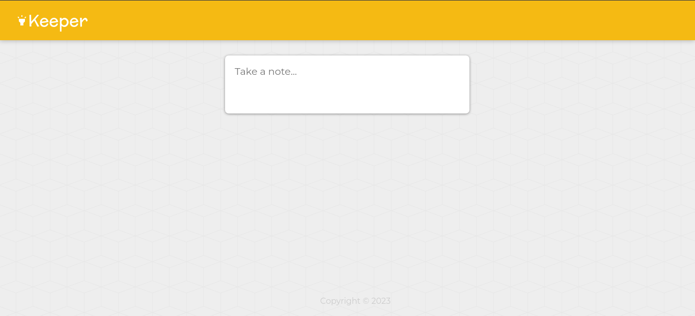
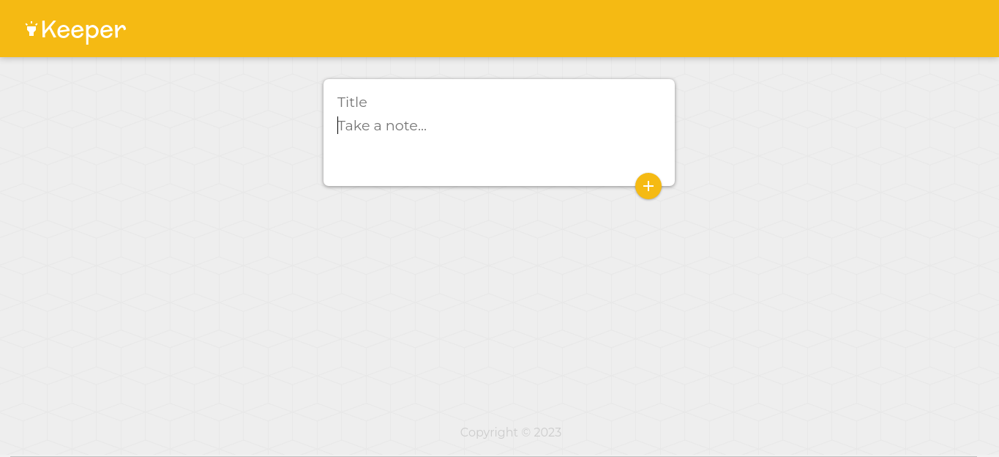
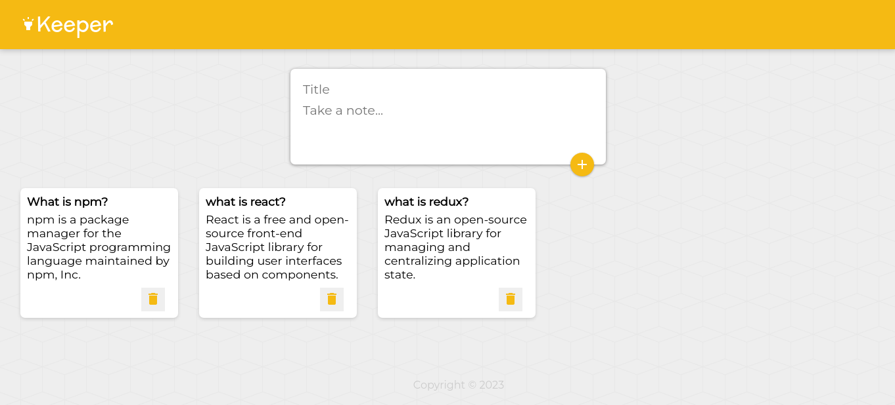

# Keeper

This is simple note taking app built using Reactjs, a JavaScript front end library for building user interfaces.

## Demo

https://keeper-skolap.web.app/

## Tech Stack

React, Redux, Material Ui, Firebase Hosting

## Features

- Add note
- Remove note

## Installation

- clone repo
- `npm install`
- `npm start`

## Authors

- Shailesh Kolap - [skolap](https://github.com/Skolap)

## Screenshots

  
  
  

<!-- 

 -->
